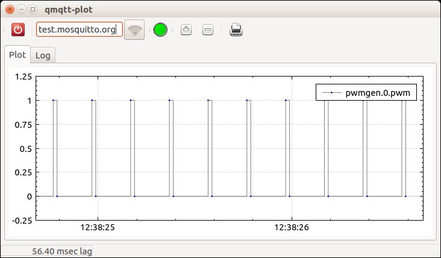

### A Qt5 app that plots timestamped MQTT data [](https://github.com/koppi/qmqtt-plot/actions/workflows/c-cpp.yml)



* Quick Video demo: [MQTT broker latency test with Machinekit + EtherCAT on Raspberry Pi3 ](https://www.youtube.com/watch?v=uFbr7xBjItE)

#### Build and install qmqtt-plot

```bash
gh repo clone koppi/qmqtt-plot
cd qmqtt-plot
cd libqmqtt
qmake
make -j$(nproc)
sudo make install
cd ..
qmake
make
./qmqtt-plot
```

* Enter your MQTT broker's hostname and click connect.

#### Credits

Libraries included:

* [qcustomplot.com](http://qcustomplot.com)
* [qmqtt](https://github.com/emqtt/qmqtt)

Artwork:

* [qmqtt-plot.svg](https://openclipart.org/detail/200755/primary-plot) by danny
